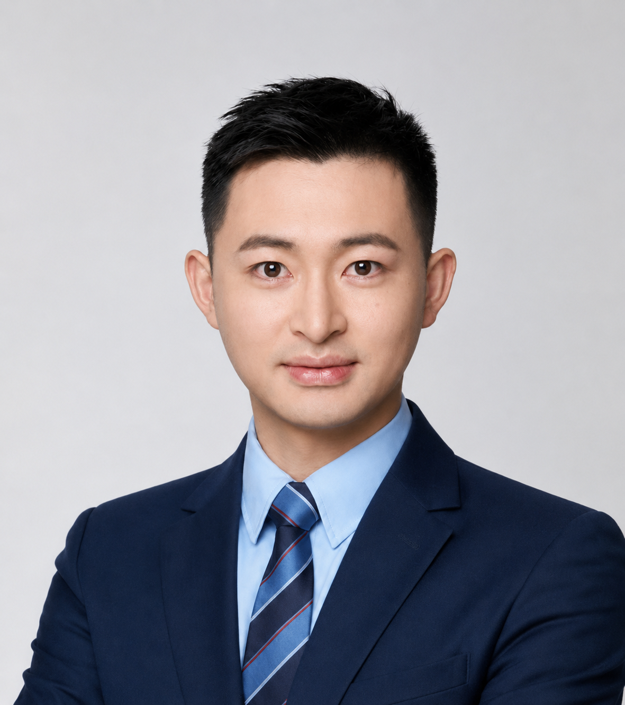
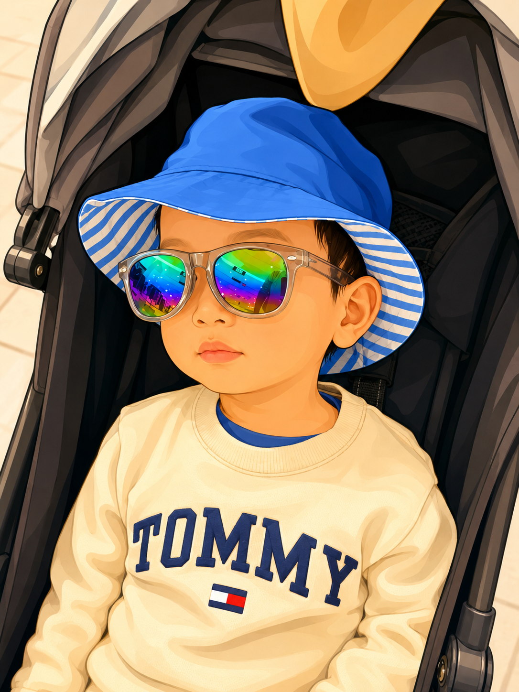
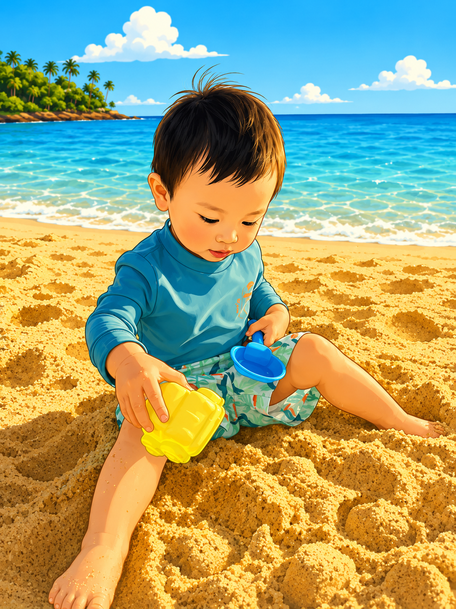

## Chang Li, Principal Investigator

:::::: team-grid

::: team-photo
{width="220px"}
:::

::::: team-info

::: team-background

### Background

- **2027 – Present**: Assistant Professor, Westlake University
- **2024 – 2027**: Postdoc, Lawrence Berkeley National Laboratory
- **2019 – 2024**: PhD in Chemistry, University of Waterloo
- **2015 – 2019**: Bachelor in Materials Science and Engineering, Huazhong University of Science and Technology

:::

::: team-links

### Links

::: link-row
📧 [lichang@westlake.edu.cn](mailto:lichang@westlake.edu.cn){.email}
📚 [Google Scholar](https://scholar.google.com/citations?user=nvmiWvoAAAAJ&hl=en)
<a href="https://orcid.org/0000-0001-5420-3856">  ORCID </a>
**Office:** H6
:::

:::

:::::

::::::

## Postdocs

:::::: team-grid

::: team-photo
{width="220px"}
:::

::::: team-info

::: team-background

### Alex

- Year in joining group: 2027
- Education: Ph.D. in Traveling (2026, University of Independence)
- Research Interests: Solid state batteries
- About Me: I like eating

:::

::: team-links

### Contact

- 📧 [alex@westlake.edu.cn](mailto:alex@westlake.edu.cn){.email}

:::

:::::

::::::

## PhD Students

:::::: team-grid

::: team-photo
{width="220px"}
:::

::::: team-info

::: team-background

### LYZ

- Year in joining group: 2027
- Education: B.Eng. in Exploring (2026, University of Curiosity)
- Research Interests: Mg batteries
- About Me: I like cooking

:::

::: team-links

### Contact

- 📧 [lyz@westlake.edu.cn](mailto:lyz@westlake.edu.cn){.email}

:::

:::::

::::::

## Research Assistants

:::::: team-grid

::: team-photo
{width="220px"}
:::

::::: team-info

::: team-background

### YZ A. Li

- Year in joining group: 2027
- Education: B.Eng. in Jumping (2026, University of Courage)
- Research Interests: Automation
- About Me: I like robots

:::

::: team-links

### Contact

- 📧 [yal@westlake.edu.cn](mailto:yal@westlake.edu.cn){.email}

:::

:::::

::::::